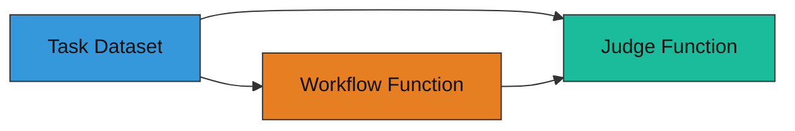

# Overview
Source: https://agentscope-ai-786677c7.mintlify.app/tune-agent/tune-your-first-agent

Using the tuner module to enhance agent performance

AgentScope provides the `tuner` module to enhance your agents' performance on specific tasks.

The `tuner` module currently supports three different methods to tune your agents:

| Method                     | Technique                   | Description                                                              | Tuning Cost         | Final Tuning Effect                 |
| -------------------------- | --------------------------- | ------------------------------------------------------------------------ | ------------------- | ----------------------------------- |
| **Model Selection Tuning** | Model Comparison            | Select the best model from a set of candidates based on task performance | Low                 | Improvement depends on candidates   |
| **Prompt Tuning**          | Prompt Optimization         | Optimize the prompts used by your agent to improve task performance      | Low to Medium       | Moderate to high improvement        |
| **Model Weights Tuning**   | Reinforcement Learning (RL) | Adjust the model's parameters behind your agent application              | High (GPU required) | Potentially significant improvement |

This tutorial will guide you through how to leverage the `tuner` module, including:

* Introducing the core components of the tuner module

* Demonstrating the key code required for the tuning workflow

* Showing how to configure and run the tuning process

## Core Components

The `tuner` module introduces three core components essential for all three tuning methods:

* Task Dataset: A collection of tasks for tuning and evaluating the agent.

* Workflow Function: Encapsulates the agent's logic to be tuned.

* Judge Function: Evaluates the agent's performance on tasks and provides reward signals for tuning.



The following sections demonstrates how to use `tuner` to tune a simple math agent.

## Task Dataset

A collection of tasks that the agent will be tuned and evaluated on during the tuning process. Each task typically includes input data and expected outputs.
In math agent tuning, the task dataset may consist of various math problems along with their correct solutions.

`tuner` requires the task dataset follows the [Huggingface Datasets](https://huggingface.co/docs/datasets/) format, and can be loaded directly through the `datasets.load_dataset` API.

A simple example of satisfying this requirement is shown below:

```
my_dataset/
    ├── train.jsonl  # training samples
    └── test.jsonl   # evaluation samples
```

Each line in the `jsonl` files represents a single task sample in JSON format, for example:

```json theme={null}
{"question": "What is 2 + 2?", "answer": "4"}
{"question": "What is 5 * 6?", "answer": "30"}
```

Before using the dataset in the tuning process, you can verify its structure and content as follows:

```python theme={null}
from agentscope.tuner import DatasetConfig

dataset = DatasetConfig(path="my_dataset", split="train")
dataset.preview(n=2)
# Output:
# [
#   {
#     "question": "What is 2 + 2?",
#     "answer": "4"
#   },
#   {
#     "question": "What is 5 * 6?",
#     "answer": "30"
#   }
# ]
```

## Workflow Function

The workflow function defines how the agent processes each task. It encapsulates the logic of the agent, including how it interprets the input data and generates responses.

<Note>
  In most cases, the workflow function requires no code changes compared to your original agent implementation — you simply wrap the agent logic into a function with a specific signature. Different tuning methods require different input parameters, but the core idea remains the same.
</Note>

Below is an example of a simple math agent workflow function:

```python theme={null}
from typing import Dict, Optional
from agentscope.agent import ReActAgent
from agentscope.formatter import OpenAIChatFormatter
from agentscope.message import Msg
from agentscope.model import OpenAIChatModel, ChatModelBase
from agentscope.tuner import WorkflowOutput


async def example_workflow_function(
    task: Dict,
    # model: Optional[ChatModelBase] = None,
    # system_prompt: Optional[str] = None,
) -> WorkflowOutput:
    """An example workflow function for tuning.

    Args:
        task (`Dict`): The task information, which is a sample from the task dataset.
        model (`Optional[ChatModelBase]`, *optional*):
            Only used in model weights tuning and model selection tuning. The model to be tuned or selected.
        system_prompt (`Optional[str]`, *optional*):
            Only used in prompt tuning. The system prompt to be optimized.

    Returns:
        `WorkflowOutput`: The output generated by the workflow.
    """
    agent = ReActAgent(
        name="react_agent",
        sys_prompt="You are a helpful math assistant.",
        # sys_prompt=system_prompt,  # If prompt tuning is used
        model=OpenAIChatModel(...),
        # model=model,  # If model weights tuning or model selection tuning is used
        formatter=OpenAIChatFormatter(),
    )

    response = await agent.reply(
        msg=Msg(
            "user",
            task["question"],  # extract question from task
            role="user",
        ),
    )

    return WorkflowOutput(  # wrap the response in WorkflowOutput
        response=response,
    )
```

Before tuning, you can run the workflow function locally to ensure it works as expected, here we use model weights tuning as an example:

```python theme={null}
import asyncio
import os
from agentscope.model import DashScopeChatModel

task = {"question": "What is 123 plus 456?", "answer": "579"}
model = DashScopeChatModel(
    model_name="qwen-max",
    api_key=os.environ["DASHSCOPE_API_KEY"],
)

workflow_output = asyncio.run(example_workflow_function(task=task, model=model))

assert isinstance(
    workflow_output.response,
    Msg,
), "In this example, the response should be a Msg instance."
print("\nWorkflow response:", workflow_output.response.get_text_content())
```

## Judge Function

The judge function evaluates the agent's performance on each task and provides reward signals that guide the tuning process.

Here is an example of a judge function for the math agent:

```python theme={null}
from typing import Any
from agentscope.tuner import JudgeOutput


async def example_judge_function(
    task: Dict,
    response: Any,
) -> JudgeOutput:
    """A very simple judge function only for demonstration.

    Args:
        task (`Dict`): The task information, which is the same as the input to the workflow function.
        response (`Any`): The response field from the WorkflowOutput.
    Returns:
        `JudgeOutput`: The reward assigned by the judge.
    """
    ground_truth = task["answer"]
    reward = 1.0 if ground_truth in response.get_text_content() else 0.0
    return JudgeOutput(reward=reward)
```

You can also test the judge function locally to ensure it behaves as expected:

```python theme={null}
# workflow_output = asyncio.run(example_workflow_function(task=task, model=model))

judge_output = asyncio.run(
    example_judge_function(
        task,
        workflow_output.response,
    ),
)
print(f"Judge reward: {judge_output.reward}")
```

In practice, you may want to implement a more sophisticated judge function that can better evaluate the agent's performance on complex tasks.

<Tip>
  You can leverage AgentScope's evaluation metrics or [OpenJudge](https://github.com/agentscope-ai/OpenJudge) to build a more advanced judge function for complex tasks.
</Tip>
